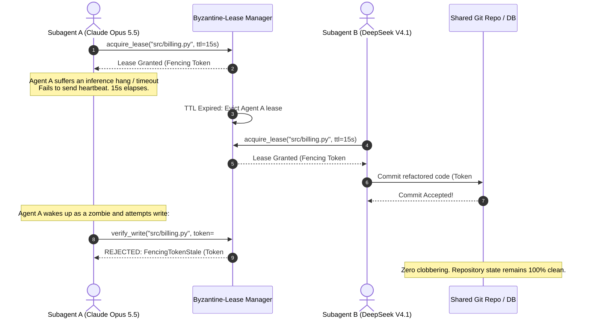
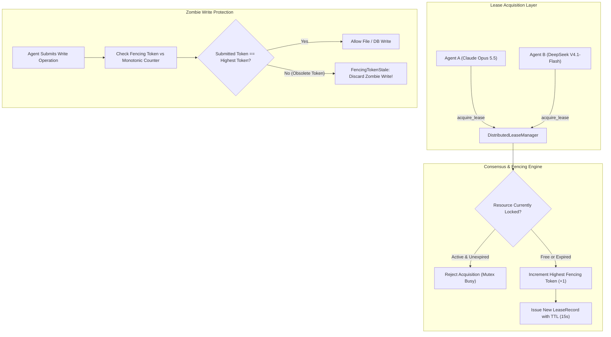
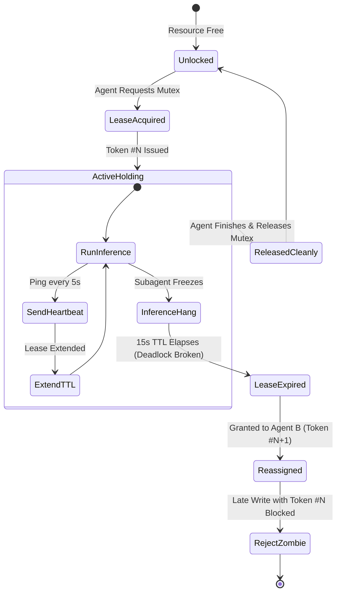

# 🔒 Byzantine-Lease

> **Distributed Mutex & Fencing Token Lease Manager for Multi-Agent Swarm Concurrency**  
> Prevents race conditions, git merge collisions, and split-brain repository state in parallel agent swarms (**Claude Opus 5.5**, **DeepSeek V4.1-Flash**, **Gemini 3.8 Flash**). Implements monotonically increasing fencing tokens, auto-renewing TTL heartbeats, and automatic deadlock eviction.

[](https://opensource.org/licenses/MIT)
[](https://www.python.org/downloads/)
[](https://github.com/AAH20/byzantine-lease)
[](https://anthropic.com)

---

## ⚡ The Problem: The Swarm Concurrency Collision

When autonomous orchestrators (**Claude Opus 5.5**) launch parallel worker agents (**DeepSeek V4.1-Flash**, **Gemini 3.8 Flash**) across multi-threaded or distributed environments:
1. **Simultaneous File Clashes**: Two subagents attempting to modify `src/billing.py` at the same time cause corrupted merge states and overwritten code changes.
2. **Zombie Agent Late Writes**: A subagent suffers an inference freeze or network partition. After its lock times out and another agent completes the work, the frozen agent wakes up and submits an obsolete write, clobbering the correct code.
3. **Deadlocks**: A subagent that crashes or enters an infinite loop holds a lock indefinitely, freezing the entire swarm.

**Byzantine-Lease** implements distributed consensus locking for AI agents. Resources are protected by time-bounded leases (TTL: 15s) renewed automatically during active streaming inference. Every lease issuance increments a **Monotonic Fencing Token**. Any late write from a zombie agent carrying an obsolete fencing token is instantly rejected, guaranteeing mathematical consistency.

---

## 🏛️ Architecture & Fencing Flow







---

## 🚀 Key Features

- **Monotonic Fencing Tokens**: Eliminates race conditions by strictly rejecting writes from zombie agents whose leases expired.
- **Deadlock Breaking Eviction**: Automatically purges abandoned locks if a subagent hangs or enters an infinite loop.
- **Active Streaming Heartbeats**: Allows multi-minute autonomous tasks to retain exclusive access by auto-renewing TTL leases during inference.
- **Sub-Millisecond Mutex Checks (<0.01ms)**: High-throughput in-memory state tracking.
- **Pure Python Standard Library**: Zero external database or Redis prerequisites.

---

## 📦 Quick Start

### Installation

```bash
pip install byzantine-lease
```

### Python SDK Usage

```python
from byzantine_lease import DistributedLeaseManager

manager = DistributedLeaseManager()
resource = "git://repo/src/billing.py"

# 1. Agent A acquires lease with Fencing Token #1
lease_a = manager.acquire_lease(resource, agent_id="agent_a", ttl_seconds=15.0)
print(f"Token: #{lease_a.fencing_token}")  # #1

# 2. Agent A heartbeats while streaming code
manager.renew_heartbeat(resource, agent_id="agent_a", fencing_token=lease_a.fencing_token)

# 3. Verify write legality before committing
result = manager.verify_write(resource, submitted_token=lease_a.fencing_token)
if result.accepted:
    print("Write verified legally. Safe to commit.")

# 4. Release when task completes
manager.release_lease(resource, agent_id="agent_a", fencing_token=lease_a.fencing_token)
```

---

## 💻 CLI Interactive Demonstration

Run the built-in interactive demo to observe real-time mutex acquisitions, inference timeouts, and zombie write rejections:

```bash
byzantine-lease demo
```

```
==========================================================================
  BYZANTINE-LEASE: Distributed Mutex & Fencing Tokens for Agent Swarms
  Preventing Race Conditions & Split-Brain Edits in Claude Opus 5.5 & DeepSeek
==========================================================================

[STEP 1] SUBAGENT A (Claude Opus 5.5) ACQUIRES MUTEX LEASE
  Resource Key    : git://repo/src/billing_service.py
  Holder Agent    : subagent_claude_opus
  Fencing Token   : #1
  Lease TTL       : 1.0s

[STEP 2] SIMULATING SUBAGENT A NETWORK PARTITION / INFERENCE HANG
  Subagent A stops sending heartbeats. Sleeping 1.2s to expire lease...
  TTL expired. Lease automatically transitioned to EXPIRED.

[STEP 3] SUBAGENT B (DeepSeek V4.1-Flash) DETECTS DEADLOCK & CLAIMS LEASE
  New Holder Agent : subagent_deepseek_v4
  New Fencing Token: #2 (Monotonically Incremented)

[STEP 4] SUBAGENT A WAKES UP AS ZOMBIE & ATTEMPTS COMMIT WITH TOKEN #1
  Write Accepted : False
  Arbiter Action : FencingTokenStale: Submitted token #1 is obsolete. Active token is #2. Zombie write blocked.

[STEP 5] SUBAGENT B COMMITS REFACTORED CODE WITH TOKEN #2
  Write Accepted : True
  Arbiter Action : Write verified legally. Fencing token valid and active.

==========================================================================
  BYZANTINE-LEASE CONCURRENCY METRICS SUMMARY
  Leases Granted          : 2
  Zombie Writes Rejected  : 1
  Deadlocks Broken        : 1
  Zero Race Conditions - 100% Repository Consistency
==========================================================================
```

---

## 🧪 Testing

Run the full unit test suite:

```bash
python3 -m unittest discover -s tests -p "test_*.py" -v
```

---

## 📄 License

MIT License. Designed and maintained for swarm concurrency control in 2026.
